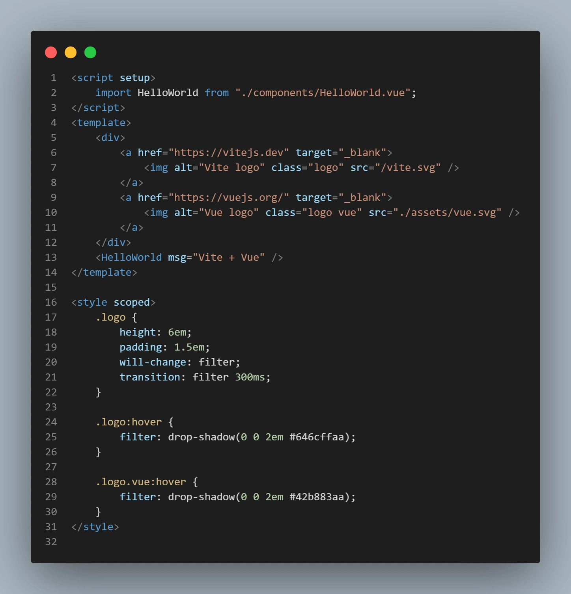
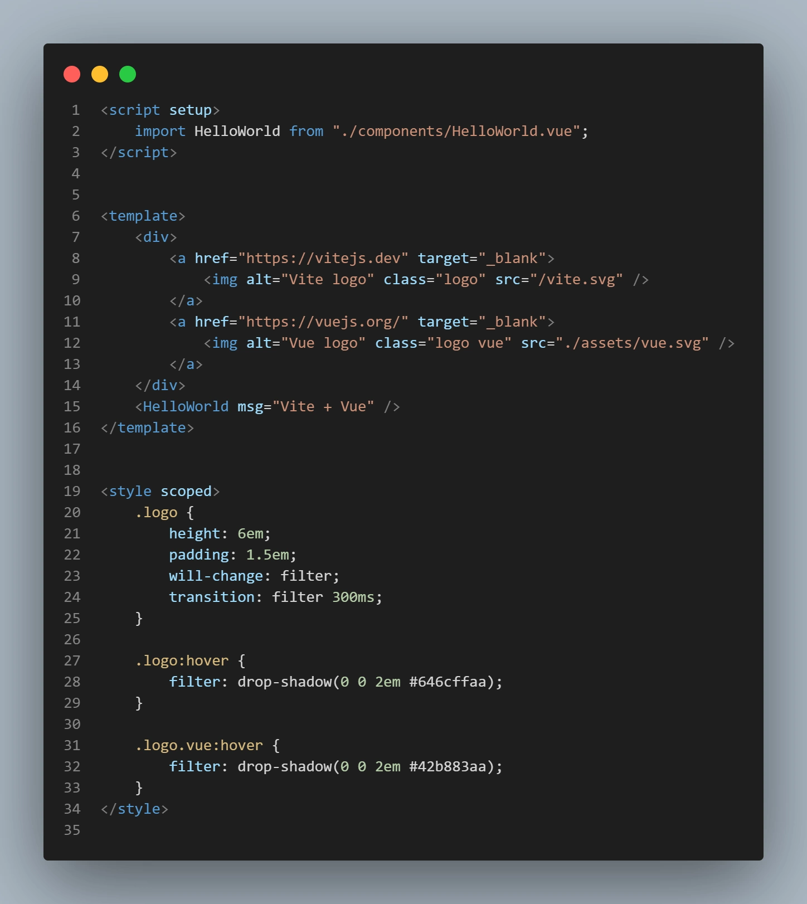

# Vue separate blocks - Sébastien D
## 📖 Description
Automatically separates the script, template, and style blocks of your Vue.js files by a custom number of new line(s).


## 📜Installation
```cmd
npm i vue-separate-blocks --save-dev
```


## ⚙️ Use
1. Add this script into your "package.json" and customize the number of new line(s) you want (replace number with a integer) : 
```javascript
"separate-blocks": "node -e \"require('vue-separate-blocks').separateBlocks(number)\""
```

2. Run the command :
```cmd
npm run separate-blocks
```

Example :
```javascript
"separate-blocks": "node -e \"require('vue-separate-blocks').separateBlocks(2)\""
```

Before :


After :



## 📝 License
MIT © [sebastien-d-me](https://github.com/sebastien-d-me)
